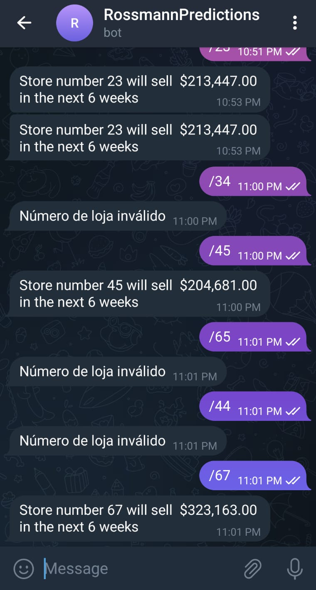

# 1- Problema de Negócio

A empresa Rossman é uma rede de farmácias com dezenas de lojas, o diretor precisa saber com pelo menos seis semanas de antecedência a previsão aproximada de vendas de cada loja, pois, a partir dessa informação pode definir o valor de investimento para cada loja, alocação de recursos, aumento de força de trabalho, etc.

Além disso, ele solicitou que a consulta da previsão de vendas de cada loja seja feita de uma maneira prática e que ele possa realizar a consulta de qualquer lugar através do celular.

# 2- Premissas do Negócio

- Foi utilizado apenas um tipo de culinária de cada restaurante, a primeira culinária da lista de cada restaurante foi tomada como a principal.

- As 3 principais visões assumidas para criação do dashboard foram: Visão Países, Visão Cidades, Visão Culinárias

# 3- Estratégia da Solução

O projeto foi desenvolvido pensado nas necessidades do diretor, que eram:

- Ter acesso as informações a qualquer momento, 
- Que a informação pudesse ser obtida facilmente apenas com o celular.

Com base nessas solicitações foi definido a entrega do produto de Data Science no modelo de consulta via bot no aplicativo de mensagem Telegram, onde o diretor poder escrever o número da loja que deseja e o modelo lhe retorna a previsão para as próximas seis semanas da respectiva loja.

Para executar esse projeto utilizei os seguintes passos:

## Passo 1 - Descrição dos Dados: Renomeação de colunas, mudanças de tipos, preenchimento/exlusão de dados faltantes, visão inicial das variáveis numéricas e categóricas.

## Passo 2 - Feature Engineering: Criação das hipóteses a serem validadas na EDA, criação de novas features necessárias na EDA.

## Passo 3 - Filtragem dos Dados: Filtragem das linhas e colunas de acordo com o entendimento do negócio.

## Passo 4  - Análise Exploratória de Dados: Análise de variável resposta, análise únivariada das variáveis numéricas e categóricas, análise bivariada através das hipóteses criadas no passo anterior, correlação de pearson, método V de Cramer.

## Passo 5 - Preparação dos Dados: Aplicãção das transformações e dummização das variáveis.

## Passo 6 - Seleção das Features: Foi aplicado o algoritmo Boruta para selecionar as variáveis que mais explicam a variável resposta.

## Passo 7 - Modelos de Machine Learning: Treinamento, teste e avaliação de 5 modelos de machine learning.

## Passo 8 - Fine Tunning: Busca por hiperparâmetros que possam melhorar o modelos selecionado no passo anterior

## Passo 9 - Business Performance: Tradução dos resultados do modelo para aplicação no negócio, a previsão realizada e quão confiável a mesma será para o diretor realizar as tomadas de decisão.

## Passo 10 - Deploy do modelo em produção: Colocar o modelo na Cloud e criar a conexão do modelo como bot no telegram através da API.

# 4- Top 3 Insights de Dados

- As lojas vendem mais após o décimo dia de cada mês, é importante buscar mais informações para entender esse fenômeno e utilizá-lo para alavancar as vendas.

- A comparação das vendas a cada ano, mostra uma tendência de queda nas vendas, informação importante para analisar mais profundamente a causa dessa queda e como sair dessa tendência.

- Lojas com mais promoções consecutivas tendem a vender menos, seria importante fazer uma avaliação das promoções oferecidas buscando diminuir a frequência e aumentar a qualidade, com isso haverá redução de custos e maximização da receita nas promoções.

# 5- O produto final do projeto

As predições podem ser acessadas na conversa no aplicativo Telegram através desse link: https://t.me/PredRossmannBot

É necessário colocar barra "/" antes do número da loja.

(Ao fazer a primeira solicitação o modelo vai demorar alguns minutos para responder)

# 6- Conclusão

O objetivo desse projeto é criar um modelo de predição que ajudasse o diretor a tomar decisões com maior precisão em relação aos recursos finaceiros.

Aplicando esse modelo ele poderá tomar decisões com uma variação máxima de menos de 1% quando observamos a soma de receita de todas as lojas. 

# 7- Próximos passos

- Criar novas opções de consulta no bot.

- Melhorar a performance de previsão de algumas lojas com erro muito alto.

- Criar um dashboard no Power BI ou Tableau para um acompanhamento mais profundo.